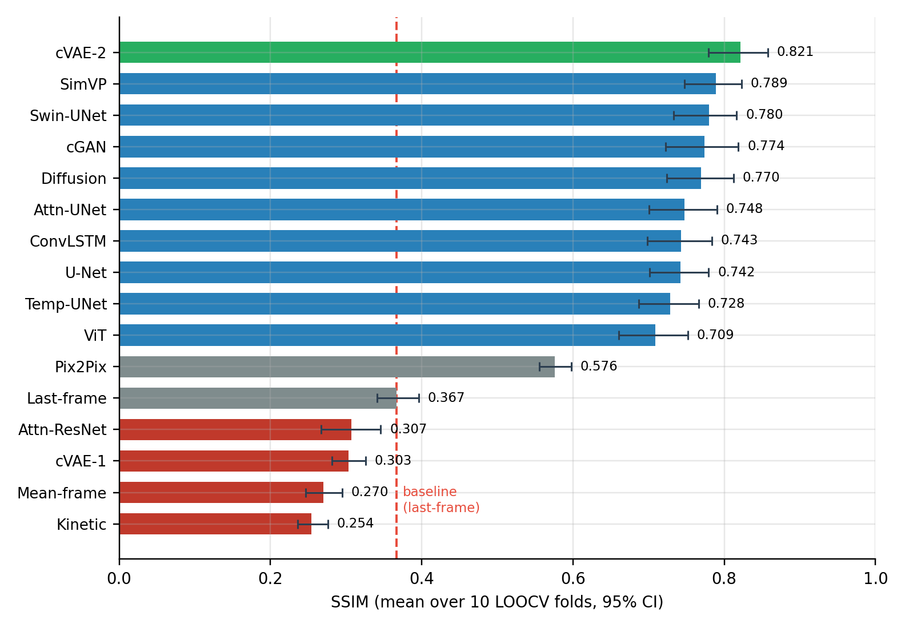
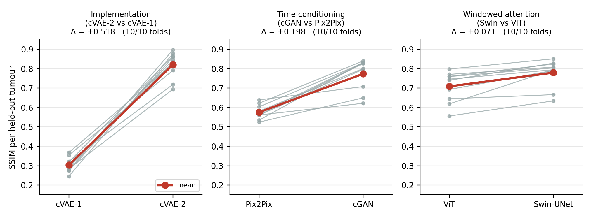
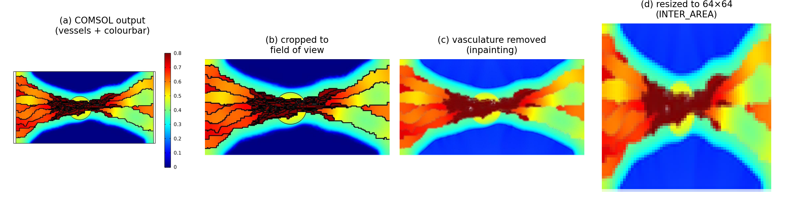
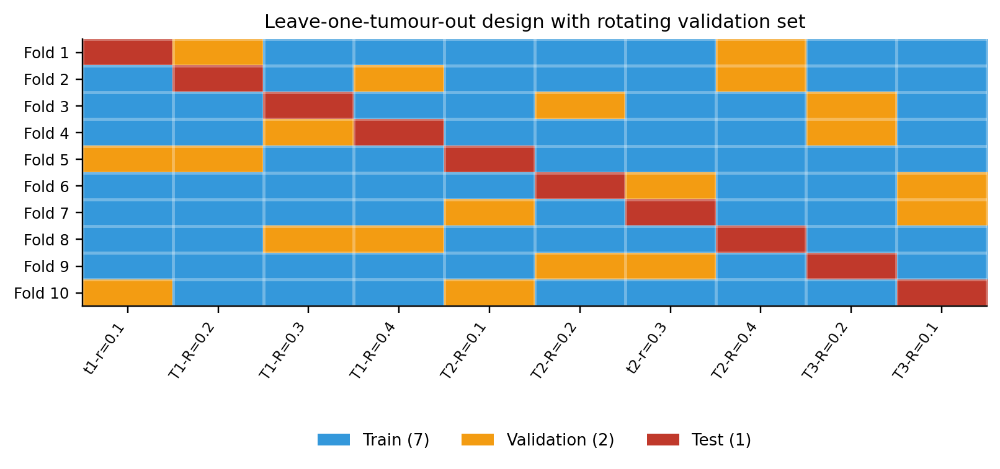
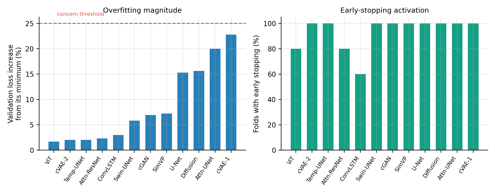

# Temporal Frame Prediction in Simulated Dynamic PET

Benchmark of **14 predictive models** for forecasting future frames of a
simulated dynamic ¹⁸F-FDG PET time series from only the first 10 frames,
evaluated with leave-one-tumour-out cross-validation.

**Author:** Matin Havaei — K. N. Toosi University of Technology

> **All data in this study is computer-simulated.** No patient data was used.
> Results are a proof-of-concept and are not clinically validated.

---

## Main finding

The headline result is not the leaderboard — it is an ablation.

**Fixing four implementation choices in a conditional VAE moved it from
0.303 to 0.821 SSIM (+0.518).** That single gap is larger than the entire
0.11 spread between the ten architectures that beat the baseline.

At this data scale, **implementation choices outweighed architectural choice.**



---

## Results

Leave-one-tumour-out cross-validation, 10 folds, SSIM in RGB space.
95% confidence intervals from a cluster bootstrap resampling tumours.

| Model | SSIM | 95% CI | PSNR (dB) | MAE | Beats baseline |
|---|---|---|---|---|---|
| **cVAE-2** | **0.821** | 0.779–0.858 | 24.82 | 0.041 | yes |
| SimVP | 0.789 | 0.747–0.823 | 23.30 | 0.047 | yes |
| Swin-UNet | 0.780 | 0.733–0.816 | 23.50 | 0.048 | yes |
| cGAN | 0.774 | 0.722–0.819 | 22.92 | 0.051 | yes |
| Diffusion | 0.770 | 0.724–0.812 | 24.06 | 0.046 | yes |
| Attention U-Net | 0.748 | 0.700–0.790 | 21.05 | 0.056 | yes |
| ConvLSTM | 0.743 | 0.699–0.784 | 21.61 | 0.058 | yes |
| U-Net | 0.742 | 0.701–0.779 | 21.33 | 0.057 | yes |
| Temporal U-Net | 0.728 | 0.687–0.766 | 20.97 | 0.058 | yes |
| ViT | 0.709 | 0.661–0.752 | 21.72 | 0.054 | yes |
| Pix2Pix | 0.576 | 0.555–0.598 | 15.63 | 0.121 | yes |
| *Baseline — last frame* | *0.367* | *0.341–0.396* | *10.34* | *0.250* | — |
| Attention-ResNet | 0.307 | 0.267–0.346 | 11.91 | 0.167 | no (n.s.) |
| cVAE-1 | 0.303 | 0.282–0.326 | 11.87 | 0.184 | no |
| *Baseline — mean frame* | *0.270* | *0.246–0.295* | *9.15* | *0.287* | no |
| Kinetic curve fit | 0.254 | 0.236–0.276 | 9.72 | 0.261 | no |

**11 of 14 models beat the baseline, each in all 10 folds**
(Wilcoxon signed-rank, statistic = 0.0, Holm-adjusted p = 0.027).

### Controlled ablations

Each pair differs in exactly one respect. All three favour the modified
variant in **10 of 10 folds**.

| Comparison | What it isolates | Δ SSIM |
|---|---|---|
| cVAE-2 − cVAE-1 | Implementation only, same architecture family | **+0.518** |
| cGAN − Pix2Pix | Explicit time conditioning + SSIM loss | **+0.198** |
| Swin-UNet − ViT | Windowed local vs global attention | **+0.071** |



---

## Task

Given the first 10 frames of a tumour's time series, predict the frame at an
arbitrary later time.

The context covers only ~8% of the time axis while prediction runs to 100%, so
the **prediction horizon is about 16× the width of the observed window**. This
is the single most important fact for interpreting the results, and it explains
why the classical per-voxel kinetic fit fails: extrapolating an exponential 16×
beyond its fitting range amplifies small errors in the decay constant enormously.

---

## Data

Generated by a multi-scale biomathematical model — tumour-induced angiogenesis,
interstitial fluid flow (Darcy), and FDG transport by convection-diffusion-reaction
equations — solved in COMSOL Multiphysics. The method follows
[Abazari et al., *Cancers* 2022, 14, 2786](https://doi.org/10.3390/cancers14112786).

| Property | Value |
|---|---|
| Tumours | 10 independent capillary networks, 1–3 cm diameter |
| Frames per tumour | 130–150 (median 150) |
| Image size | 64 × 64 × 3, jet colormap |
| Quantity shown | Standardised uptake value (SUV) |
| Context window | First 10 frames |

**The dataset is not included in this repository.** Point the scripts at your own
data directory with `00_set_paths.py`.

### Preprocessing



1. Crop the COMSOL export to the field of view
2. **Remove vessel outlines by inpainting.** The black lines are a graphical
   overlay, not physics. Left in place, a network can memorise vessel geometry
   instead of learning kinetics, and the high-contrast edges distort SSIM.
3. Drop the final ~50 frames (constant plateau after washout — no temporal
   information, and they bias the model toward flat predictions)
4. Resize to 64 × 64 with `INTER_AREA` (correct for downsampling colormapped
   images; bilinear causes aliasing)
5. Normalise per frame to [−1, 1] — **per frame**, so no statistic leaks across
   cross-validation folds

---

## Evaluation



- **Leave-one-tumour-out, 10 folds.** Per fold: 7 train / 2 validation / 1 test,
  **split at tumour level**. Frames within a tumour are strongly correlated, so a
  random frame-level split would let the model memorise a specific tumour and
  inflate accuracy — the classic information-leakage error.
- **Rotating validation set.** A fixed seeded permutation puts each tumour in
  validation exactly twice and in training seven times. A naive "first two of the
  remaining list" places two tumours in validation in 9 of 10 folds, so they
  barely contribute to training at all.
- **Tumour is the unit of analysis.** Metrics are averaged within tumour and 95%
  CIs come from a cluster bootstrap resampling *tumours* (10,000 resamples).
  Frame-level bootstrap gives intervals several times too narrow.
- **Two pre-specified comparison families:**
  - *Confirmatory* — 14 model-vs-baseline tests, Holm-corrected
  - *Exploratory* — 120 all-pairs comparisons. **Zero are significant, and this
    is arithmetic, not a finding:** the smallest attainable two-sided Wilcoxon
    p at n = 10 is 2/2¹⁰ = 0.00195, and 0.00195 × 120 = 0.234. No pairwise
    comparison *can* reach significance regardless of effect size.
- Hyperparameters fixed a priori, identical across architectures. No tuning
  against test folds.

### Overfitting



Validation loss ended at most 22.8% above its per-fold minimum (median ~6%), and
early stopping fired in 60–100% of folds. Overfitting was measured and prevented,
not assumed absent.

One caveat worth stating: validation loss correlated only weakly with held-out
test performance for most models (r between −0.18 and +0.22; |r| > 0.63 is needed
for significance at n = 10). With two validation tumours per fold, the
model-selection signal reflects *which* tumours landed in validation more than it
reflects generalisation.

---

## Installation

Requires Python 3.10–3.13 and an NVIDIA GPU (compute capability ≥ 7.0).

### Windows

```
01_setup_env.bat
```

### Linux / macOS

```bash
python -m venv .venv
source .venv/bin/activate
pip install torch torchvision --index-url https://download.pytorch.org/whl/cu128
pip install -r requirements.txt
```

> **Important on Windows:** plain `pip install torch` installs a **CPU-only**
> build from PyPI. The `--index-url` is what makes it CUDA-enabled.

---

## Usage

```bash
# 1. Point the scripts at your data and verify it
python 00_set_paths.py --data "/path/to/IMAGES"

# 2. Apply the validation-rotation fix to the original model scripts
python 02_patch_scripts.py

# 3. Smoke test — 3 epochs per model, meaningless numbers, proves nothing crashes
python 03_run_all.py --profile smoke

# 4. Full run (12–24 h on a mid-range GPU; resumable)
python 03_run_all.py --profile fast --results RESULTS_final

# 5. Statistics and diagnostics
python 04_compare_models.py --results RESULTS_final
python 05_overfitting_report.py --results RESULTS_final
```

On Windows, `START_HERE.bat` runs steps 1–3 and `RUN_ALL_FINAL.bat` runs 4–5.

The runner is **resumable** — completed models are skipped, so if the machine
restarts you just launch it again.

### Time profiles

| Profile | Epochs | Min epochs | Patience | Use |
|---|---|---|---|---|
| `smoke` | 3 | 1 | 2 | Pipeline check (~15 min) |
| `fast` | 400 | 80 | 60 | Real run |
| `full` | 800 | 400 | 150 | Original settings, far slower |

---

## Repository contents

```
├── pet_common.py                  Shared framework for the newer models
├── pet_*_paper.py                 15 model implementations
├── 00_set_paths.py                Data path configuration + verification
├── 02_patch_scripts.py            Validation-rotation fix (reversible)
├── 03_run_all.py                  Orchestrator (subprocess per model)
├── _pet_worker.py                 Per-model worker
├── 04_compare_models.py           Bootstrap CIs, Wilcoxon + Holm
├── 05_overfitting_report.py       Overfitting diagnostics
├── 06_rebuild_metrics.py          Rebuild metrics in one consistent space
├── *.bat                          Windows one-click launchers
├── results/                       Result tables from the reported run
├── figures/                       Figures used in the report
└── docs/PROJECT_HANDOFF.md        Full technical notes
```

### Models

**Generative:** cVAE-1, cVAE-2, cGAN, Pix2Pix, conditional Diffusion (DDPM/DDIM)
**Convolutional:** U-Net, Attention U-Net, Temporal U-Net, Attention-ResNet, SimVP
**Sequential:** ConvLSTM
**Transformer:** ViT, Swin-UNet
**Baselines:** last-frame repeat, mean-frame, per-voxel kinetic curve fit

---

## Notes and limitations

- **Simulated data only.** Simulated PET lacks real noise characteristics,
  patient motion, attenuation and partial-volume effects.
- **n = 10.** Confidence intervals are wide and the all-pairs comparison is
  underpowered by construction.
- **Internal validation only.** No independent external cohort.
- **Metric space.** Frames are jet-colormapped, and jet is a nonlinear,
  non-monotonic function of activity. Metrics here are computed on RGB.
  `pet_common.py` can invert the colormap and compute metrics on decoded
  activity; the difference is substantial — the kinetic baseline scores 0.254 in
  RGB but 0.458 in activity space, which reverses its ranking against the
  baseline.
- **Attention-ResNet** performed at baseline level while architecturally similar
  models reached 0.74–0.75. This was not resolved and should not be read as
  evidence about the architecture itself.

---

## License

MIT — see [LICENSE](LICENSE).

The data-generation methodology is described in Abazari et al., *Cancers* 2022;
that paper is not covered by this license.
