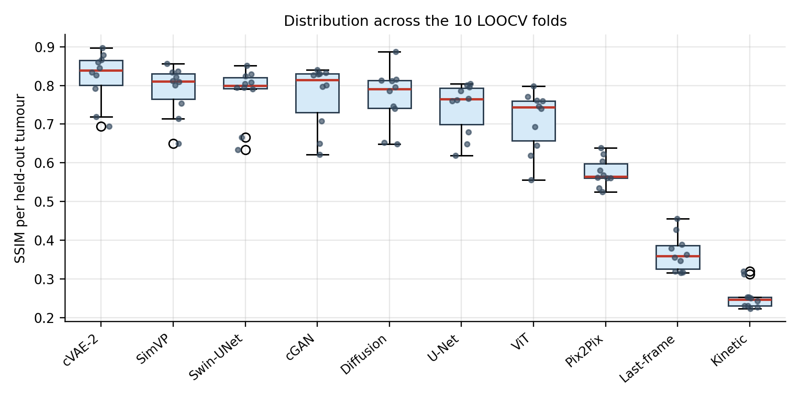
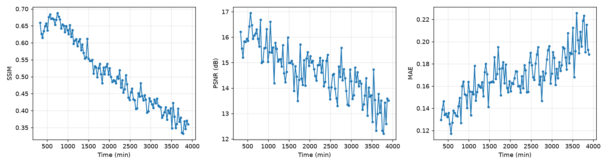
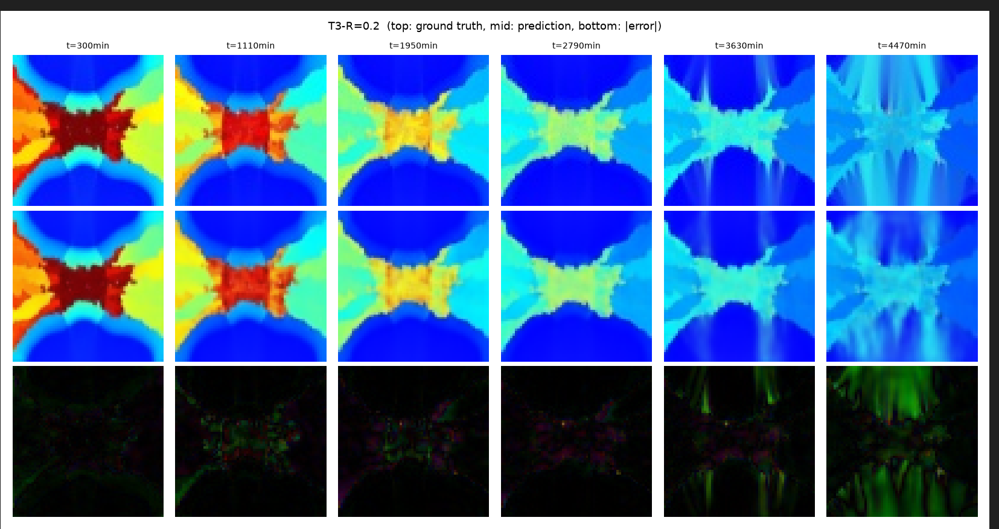
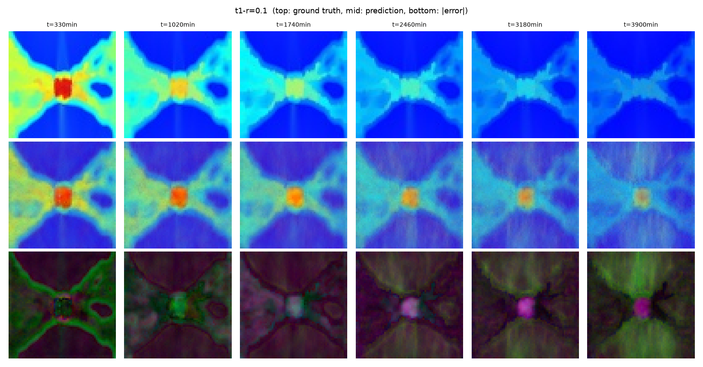

# Detailed Results

All numbers from a single leave-one-tumour-out sweep, 10 folds, RGB metric space.
Raw tables are in [`../results/`](../results/).

## Files

| File | Contents |
|---|---|
| `comparison_table.csv` | Per-model means, SDs and cluster-bootstrap 95% CIs |
| `per_tumor_means.csv` | Per-model, per-tumour means — the unit of analysis |
| `vs_baseline.csv` | Confirmatory family: each model vs last-frame baseline |
| `pairwise_tests.csv` | Exploratory family: all 120 pairwise comparisons |
| `overfitting_summary.csv` | Degradation, early-stopping rate, val↔test correlation |

## Distribution across folds



With 10 folds, the mean alone is misleading — one poorly reconstructed tumour
shifts it noticeably. The spread is substantial for every model.

## Degradation with prediction horizon



SSIM and PSNR fall, MAE rises, as the target moves further from the context
window. This determines how far ahead predictions can be trusted.

## Qualitative comparison

Best model (cVAE-2). Top: ground truth, middle: prediction, bottom: |error|.



The same architecture family before the implementation fixes (cVAE-1). The
spatial structure is largely correct; what fails is the **global colour**. The
error map shows channel disagreement rather than a spatial pattern — this is
what identified the four defects.



## On statistical power

The all-pairs family contains 120 comparisons and **none is significant after
Holm correction**. This is not a property of the data.

At n = 10 paired folds, the smallest two-sided p a Wilcoxon signed-rank test can
produce is 2/2¹⁰ = 0.00195. Holm correction multiplies the smallest p in a family
by the family size:

```
0.00195 × 120 = 0.234 > 0.05
```

So no comparison in that family can reach significance regardless of effect size.
The confirmatory family (14 comparisons) retains power:

```
0.00195 × 14 = 0.027 < 0.05
```

This is why the two families were declared in advance and why effect sizes and
fold-level consistency are reported instead of p-values.
